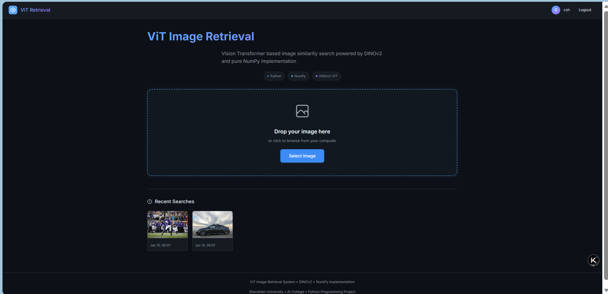
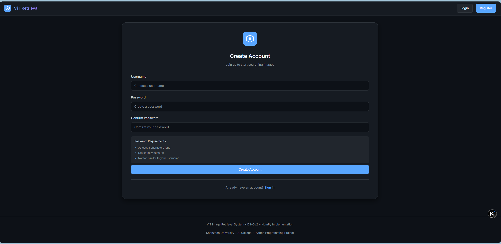
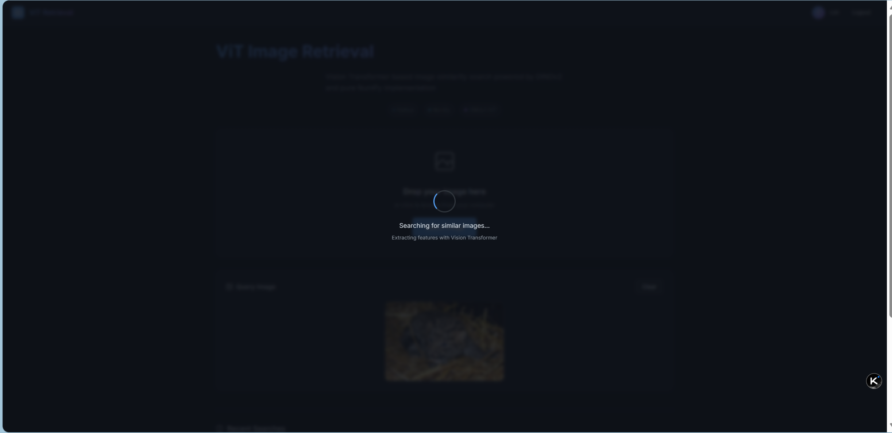
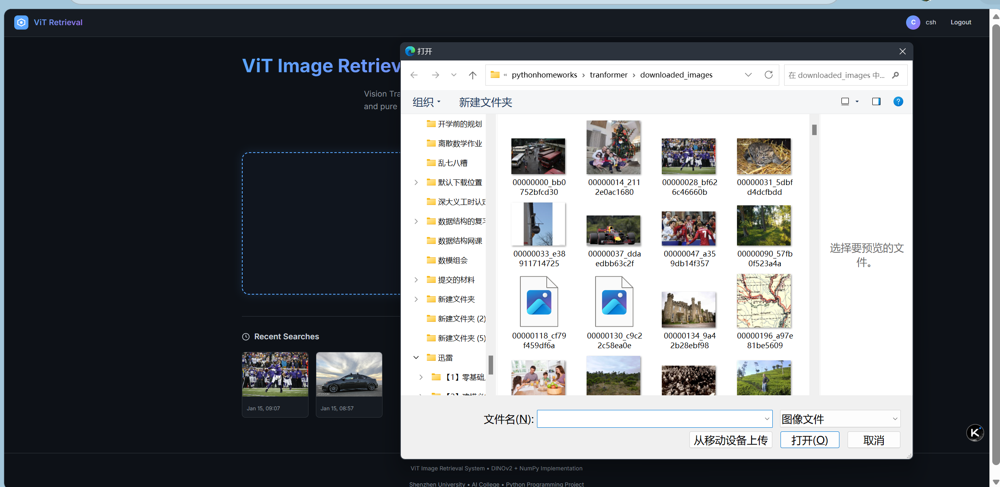
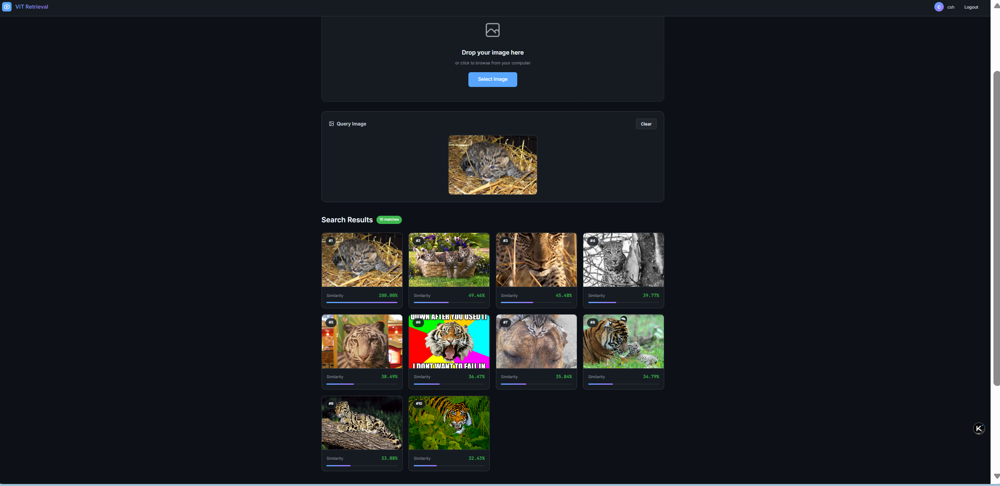

# Project 5: ViT Image Retrieval System
## 基于Vision Transformer的图像检索系统

**课程**: 深圳大学人工智能学院 Python程序设计  
**项目**: Vision Transformer (DINOv2) 图像相似性检索系统  
**作者**: 陈铄涵 (学号: 2024140014)  
**日期**: 2026年01月16日

---

## 📋 项目概述

本项目使用**纯NumPy从零实现了DINOv2-ViT-Base模型**，并结合Django框架构建Web应用，实现了用户上传图片后返回Top-10相似图片的检索功能。系统基于**14,000+张网络图片**构建Gallery数据集。

### 主要功能

- ✅ 纯NumPy实现完整的Vision Transformer模型
- ✅ 图像预处理（center_crop、resize_short_side）
- ✅ 768维特征向量提取
- ✅ 余弦相似度Top-10图像检索
- ✅ 用户注册/登录系统
- ✅ 搜索历史记录保存

---

## 🖥️ 系统截图

### 主页面 - 图片上传与历史记录

用户登录后可以看到图片上传区域和最近的搜索历史记录。



### 用户注册页面

支持用户名、密码创建，密码需满足安全要求（至少8字符、非纯数字、不与用户名相似）。



### 搜索加载中

上传图片后，系统使用ViT提取特征并进行相似度计算。



### 图片选择

支持从本地文件系统选择图片上传。



### Top-10 检索结果

系统从14,000+张Gallery图片中返回相似度最高的10张图片，每张显示相似度分数。



---

## 📁 项目结构

```
project5-SZU-python/
├── assignments/                    # ViT核心实现
│   ├── dinov2_numpy.py            # 纯NumPy实现的DINOv2-ViT模型 ⭐
│   ├── preprocess_image.py        # 图像预处理模块 ⭐
│   ├── debug.py                   # 实现正确性验证脚本 ⭐
│   ├── vit-dinov2-base.npz        # DINOv2预训练权重
│   └── demo_data/
│       ├── cat.jpg                # 测试图片
│       ├── dog.jpg                # 测试图片
│       └── cat_dog_feature.npy    # PyTorch参考特征
│
├── image_retrieval/               # Django Web应用
│   ├── manage.py
│   ├── extract_features.py        # Gallery特征提取脚本 ⭐
│   ├── features/
│   │   └── gallery_features.npz   # 预提取的Gallery特征
│   ├── static/gallery/            # Gallery图片目录
│   ├── image_retrieval/
│   │   ├── settings.py
│   │   └── urls.py
│   └── retrieval/
│       ├── views.py               # 检索逻辑与用户系统 ⭐
│       ├── models.py              # SearchRecord模型
│       └── templates/
│           ├── base.html
│           ├── index.html
│           ├── login.html
│           └── register.html
│
└── report.md                      # 详细项目报告
```

⭐ 标注为本人重点实现的核心文件

---

## 🔧 环境配置

### 依赖安装

```bash
pip install numpy scipy pillow django tqdm requests
```

### 依赖版本

| 库 | 版本 |
|---|---|
| numpy | >= 1.20 |
| scipy | >= 1.7 |
| Pillow | >= 8.0 |
| Django | >= 4.0 |
| tqdm | >= 4.60 |

---

## 🚀 快速开始

### 1. 验证ViT实现

```bash
cd project5-SZU-python/assignments
python debug.py
```

**预期输出：**
```
============================================================
  DINOv2 NumPy Implementation - Verification Script
============================================================
[1/4] Loading ViT-DINOv2 weights...    Model loaded successfully!
[2/4] Extracting features from test images...
[3/4] Loading reference features (PyTorch DINOv2)...
[4/4] Comparing with reference features...

  Cat: Cosine Similarity = 0.999883 [PASS]
  Dog: Cosine Similarity = 0.999935 [PASS]

  [PASSED] VERIFICATION PASSED!
```

### 2. 准备Gallery图片

将图片复制到Django静态目录：

```bash
# 假设已下载图片到 downloaded_images/
cp ../downloaded_images/*.jpg image_retrieval/static/gallery/
```

### 3. 提取Gallery特征

```bash
cd project5-SZU-python/image_retrieval
python extract_features.py
```

**预期输出：**
```
Loading ViT model...
Found 14002 images
Extracting features: 100%|██████████| 14002/14002
Saved 14002 features to features/gallery_features.npz
```

### 4. 数据库迁移

```bash
python manage.py migrate
```

### 5. 启动Web服务

```bash
python manage.py runserver
```

访问 http://127.0.0.1:8000 使用系统

---

## 📊 模型配置

| 参数 | 值 | 说明 |
|------|-----|------|
| hidden_size | 768 | 隐藏层维度 |
| num_heads | 12 | 注意力头数 |
| num_layers | 12 | Transformer层数 |
| patch_size | 14 | Patch大小 |
| head_dim | 64 | 每个头的维度 (768/12) |

---

## ✅ 验证结果

使用 `debug.py` 与PyTorch DINOv2参考实现对比：

| 测试图片 | Max Abs Error | Mean Abs Error | MSE | Cosine Similarity | 结果 |
|----------|---------------|----------------|-----|-------------------|------|
| cat.jpg | 8.84×10⁻² | 2.07×10⁻² | 6.86×10⁻⁴ | **0.999883** | ✅ PASS |
| dog.jpg | 5.58×10⁻² | 1.57×10⁻² | 3.88×10⁻⁴ | **0.999935** | ✅ PASS |

**通过标准**: Cosine Similarity ≥ 0.999

---

## 🔑 核心代码说明

### 1. 多头自注意力 (MultiHeadAttention)

```python
def __call__(self, x):
    B, N, D = x.shape
    # 计算Q, K, V
    q = self.q_proj(x).reshape(B, N, self.num_heads, self.head_dim).transpose(0, 2, 1, 3)
    k = self.k_proj(x).reshape(B, N, self.num_heads, self.head_dim).transpose(0, 2, 1, 3)
    v = self.v_proj(x).reshape(B, N, self.num_heads, self.head_dim).transpose(0, 2, 1, 3)
    # Attention: softmax(QK^T/sqrt(d))V
    att = softmax(np.matmul(q, k.transpose(0, 1, 3, 2)) / np.sqrt(self.head_dim))
    out = np.matmul(att, v).transpose(0, 2, 1, 3).reshape(B, N, D)
    return self.out_proj(out)
```

### 2. 位置编码插值 (interpolate_pos_encoding)

```python
def interpolate_pos_encoding(self, embeddings, height, width):
    # 使用scipy.ndimage.zoom进行2D空间插值
    patch_pos = patch_pos.reshape(1, sqrt_N, sqrt_N, dim)
    scale_h, scale_w = h0 / sqrt_N, w0 / sqrt_N
    patch_pos = zoom(patch_pos, (1, scale_h, scale_w, 1), order=1)
    return np.concatenate([cls_pos, patch_pos.reshape(1, -1, dim)], axis=1)
```

### 3. 余弦相似度检索

```python
def cosine_similarity(query_feat, gallery_feats):
    query_norm = query_feat / (np.linalg.norm(query_feat) + 1e-8)
    gallery_norms = gallery_feats / (np.linalg.norm(gallery_feats, axis=1, keepdims=True) + 1e-8)
    return np.dot(gallery_norms, query_norm)

# 获取Top-10结果
top_indices = np.argsort(similarities)[::-1][:10]
```

---

## 📝 使用说明

1. 打开浏览器访问 http://127.0.0.1:8000
2. （可选）注册账号以保存搜索历史
3. 点击上传区域或拖拽图片
4. 等待ViT特征提取和相似度计算
5. 查看Top-10相似图片及相似度分数

---

## 📚 参考资料

- [DINOv2: Learning Robust Visual Features without Supervision](https://arxiv.org/abs/2304.07193)
- [An Image is Worth 16x16 Words: Transformers for Image Recognition at Scale](https://arxiv.org/abs/2010.11929)

---

## 📄 License

本项目仅供教学使用。

---

**GitHub**: https://github.com/Csh0601/python-project5
